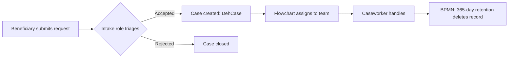

# Document an EspoCRM instance

Generates a single, self-contained Markdown document that describes a live EspoCRM instance well enough to hand it to a new developer, administrator, or auditor. This skill is meant to be **run from inside the VM where EspoCRM runs**, so you have full read access to the **database** and the **filesystem** (`custom/`, `client/custom/`, `data/config.php`), plus the **admin API** as a fallback.

You (the agent) **can run the VM/SSH/`docker`/`mysql`/filesystem commands yourself**. What you **cannot** do are **Azure portal actions** and **browser/admin-UI actions** — for anything that needs a logged-in browser (e.g. eyeballing a layout, confirming a flow visually), ask the user. Your job is to **introspect what you can, ask the user for what only they know, reconcile the two, and write it up**.

The two things below are **inputs from the user, never assumptions** — collect them before you start introspecting:

1. **Any pre-existing documentation, in any format** (wiki, Word/PDF, Confluence, diagrams, spreadsheets, a README, screenshots, tickets). This is the **first input** — ask for it up front and use it as the skeleton and as a set of claims to verify.
2. **The user's own outline of the major user journeys / flows.** Ask them to describe, in their words, who does what and to what end. This is the ground truth for *intent*; the system tells you the *mechanics*. You will cross-check one against the other and **flag every inconsistency**.

## Golden rules

1. **Ask first, assume never — for the two inputs above.** Do not fabricate user journeys from the schema, and do not skip asking for existing docs. Start Phase 0 by requesting both. **Ask for both in one round-trip**, including *where* the documentation lives — "is there documentation?" followed later by "…so where is it?" wastes a turn and stalls the gate.
2. **The live system is the source of truth for structure.** Don't infer customizations, roles, or automations from this knowledge base or from memory — read them from the running instance. **Discover the schema before querying it** (`SHOW TABLES`, `DESCRIBE <table>`) because table/column names vary by EspoCRM version and by which extensions (Advanced Pack / BPM / Sales Pack) are installed.
3. **Read-only, always.** This is a documentation task. Never modify the instance: no writes, no `rebuild`, no record edits, no config changes. Use `SELECT`/`SHOW`/`DESCRIBE` and `GET`-only API calls.
4. **Cross-check and reconcile — then flag, don't paper over.** Compare the user's narrative and any existing docs against what the system actually contains. Surface contradictions and gaps explicitly, both in a dedicated section of the document and back to the user.
5. **Document what is used and customized, not every core default.** Prioritize custom entities/fields, entities on the navbar (`tabList`), entities that hold real data, and anything referenced by a role or an automation. Don't dump all ~100 stock scopes.
6. **Never leak secrets — on the page or in the shell.** `config.php`/`config-internal.php` hold DB credentials, `passwordSalt`, `cryptKey`, `apiSecretKeys`, SMTP passwords, etc. Never copy passwords, tokens, secret keys, or hashes into the output document. Also keep DB passwords out of shell history — never pass them as `-p<pass>` arguments ([Security wiki](https://github.com/rodekruis/EspoCRM-knowledge-base/wiki/Security#usage-of-sensitive-credentials)). Read the password from config into a shell variable and pass it via the `MYSQL_PWD` environment variable, and **`unset MYSQL_PWD` when you finish introspecting** — the shell session persists after you do.
7. **Make it reproducible and verifiable.** Record the exact commands/queries you used in an appendix and cite record counts and sources, so the document can be regenerated and trusted rather than believed.
8. **Be economical with turns.** Introspection is a long tool loop; wasted output is wasted budget. Aggregate before you list, truncate blob columns, `DESCRIBE` before you `SELECT`, batch independent reads into one command, and write long output to a file to grep rather than printing it. See *Query economically* in the extraction reference.
9. **Follow the 510 way of working.** The [wiki](https://github.com/rodekruis/EspoCRM-knowledge-base/wiki) is the source of truth for how 510 builds EspoCRM — [Best practices](https://github.com/rodekruis/EspoCRM-knowledge-base/wiki/Best-practices), [Customization](https://github.com/rodekruis/EspoCRM-knowledge-base/wiki/Customization), [Security](https://github.com/rodekruis/EspoCRM-knowledge-base/wiki/Security). Expect these conventions, and where one is broken, flag it in Phase 2: new custom entities instead of customizing native ones; **flowcharts, not workflows**; all fields audited; PII on `Person`-type entities with the personal-data flag set; `lowerCamelCase` names and singular entity names. Where a convention is genuinely *not applicable* to the instance, record it as such with evidence rather than as a failure.

## Procedure

Work through the phases below and track them with a todo list. Phase 0 is a hard gate — do not begin introspection until you have asked for the two user inputs.

### Phase 0 — Gather inputs & scope (ask the user; do this first)

Ask the user, and wait for answers before introspecting. **Put all of these in a single question set** — one round-trip, not six:

- [ ] **Existing documentation — and where?** "Is there *any* existing documentation of this instance, in any format? If so, please share the link or path." Ask for the location in the same breath, not as a follow-up. Ingest whatever comes back; treat it as the draft skeleton **and** as claims to verify against the system.
- [ ] **Major user journeys?** "In your own words, what are the main things people use this CRM for — who does what, in what order, to achieve what outcome?" Record this **verbatim**; it is the intent you will cross-check.
  - **If the user answers "the documentation covers it", that satisfies the gate** — do not deadlock waiting for a separate narrative. Derive the journeys from the docs plus the live system, label them explicitly as *derived, needs confirmation*, state in the *Sources used* block that no separate interview was captured, and list confirmation as an open question. A derived-and-labelled journey is useful; a stalled skill is not.
- [ ] **Scope & audience.** Who is the doc for (new dev / admin handover / audit)? That sets the depth.
- [ ] **Access.** Confirm you can reach the DB and the app filesystem (`custom/` and `client/custom/`, plus `data/cache/` if a merged metadata view is ever needed). The DB is either a **bundled container** (name varies — `espocrm-db` or `espocrm-mysql`; discover with `docker ps`) or an **external host** (often Azure Database for MySQL); DB creds are in `data/config.php` or `data/config-internal.php` (external DBs also reference an `sslCA`). An **admin/read-only API key** is optional — only a last-resort fallback for reading effective metadata when the on-disk cache is unavailable.
- [ ] **Edition/extensions.** Community vs Advanced Pack / BPM / Sales Pack — this determines whether Workflows, BPMN flowcharts, and Reports exist. (You'll confirm from the `extension` table in Phase 1.)
- [ ] **Output location** for the `.md` file.

### Phase 1 — Introspect the live instance (read-only)

Use the **cheapest correct source** for each item. **SQL** for everything that lives in the database — roles, users, teams, workflows, BPMN, reports, scheduled jobs, templates, extensions, record counts; it is the fastest and most direct. **The filesystem — `custom/Espo/Custom/` and `client/custom/` — for structure and customizations.** 510's convention is to **rarely customize native EspoCRM entities and instead build new custom entities**, so a custom entity's *entire* definition (fields, enum options, links, layouts, dynamic logic, formula, labels) lives in `custom/` — reading it directly is the simplest and effectively complete source, no cache or API needed. Reach for the compiled **metadata cache** (or **Metadata API** as a further fallback) only for the exception: a *native* entity that has been customized, where `custom/` holds just the delta and you need the merged core+custom field list. Note that `information_schema`/`DESCRIBE` exposes physical columns but *not* field types, enum options, link semantics, labels, or dynamic logic, so it is not a substitute for metadata. Discover schema before you query. See the *Extraction reference* at the end for concrete commands.

- [ ] **1.1 Instance profile** — from `data/config.php`: `siteUrl`, `timeZone`, `language`, `defaultCurrency`, `authenticationMethod`, `applicationName`, `customPrefixDisabled`, `tabList` (which entities are on the navbar = what matters). **The installed `version` is *not* in `config.php` on 10.x — read `data/state.php`**, which also gives `latestVersion` and `latestExtensionVersions` (i.e. how far behind the instance is — worth reporting). Redact credentials.
- [ ] **1.2 Extensions / packs** — `extension` table: `name`, `version`, `is_installed`. Confirms Advanced Pack / BPM / Sales Pack presence.
- [ ] **1.3 Data model** — read **custom entities** straight from `custom/Espo/Custom/Resources/metadata/` (`scopes/*.json` for which are entities, `entityDefs/*.json` for `fields` and `links`); for a wholly-custom entity this JSON is the complete definition. Identify **native entities actually in use** from `tabList` (1.1) + a per-entity DB record count (`SELECT COUNT(*) ... WHERE deleted=0`) + the links pointing at them from custom entities — document those, don't dump every stock scope. Use the metadata cache/API only to get the merged field list of a *customized native* entity. Build a prioritized entity list (custom, on-navbar, data-holding, referenced by roles/automations). Custom entities/fields may carry a `c`/`C` prefix (e.g. `cPersonAffected`) unless `customPrefixDisabled` is set in config.
- [ ] **1.4 Custom fields** — from `custom/.../entityDefs/<Entity>.json`: list fields with type, options (enums), `required`, `readOnly`, `audited`, `isPersonalData`, tooltip. For a custom entity every field is here; for a customized native entity these are the added/overridden fields (`isCustom: true`). Note calculated/formula fields, including `notStorable` runtime fields (a SQL `select` expression, computed on display — these have no physical DB column); if there are **none**, say so, because it means every derived value is materialized and depends on the automation layer actually running (see 1.10).
  - **Establish first whether the instance holds PII at all** — don't assume it does. Check for `Person`-type scopes, fields flagged `isPersonalData`, and whether native `Contact`/`Lead` hold real rows. Some instances (statistical / geospatial / reference-data tools) legitimately hold **none**. If so, record that as a finding *with evidence* and treat the PII controls in 1.5 and §9 as **N/A**, not as failures. If PII *is* present, do the full inventory and gating analysis.
  - **Produce an audit-coverage table, not a prose remark.** "Some fields aren't audited" is unactionable; a ranked table is. For every entity emit `audited / total` and a percentage, sorted worst-first — bulk-imported measurement entities are usually the worst and matter least, so let the reader judge:
    ```bash
    sudo docker exec espocrm php -r '
    $d="/var/www/html/custom/Espo/Custom/Resources/metadata/entityDefs/";
    foreach(glob($d."*.json") as $f){
      $e=basename($f,".json"); $j=json_decode(file_get_contents($f),true);
      $fl=$j["fields"]??[]; $a=0; foreach($fl as $x){ if(!empty($x["audited"])) $a++; }
      printf("%-26s %4d fields %4d audited %3d%%\n",$e,count($fl),$a,count($fl)?round(100*$a/count($fl)):0);
    }'
    ```
- [ ] **1.5 Roles & access control** — `role`, `role_user`, `role_team`, `team`, `team_user`, `user`. Decode `role.data` (per-scope create/read/edit/delete/stream at level yes/all/team/own/no) and `role.field_data` (field-level read/edit) into readable tables. Note special permissions (assignment, export, mass-update, data-privacy, etc.), portal roles, and user types (admin/regular/api/portal) with active counts. Capture 510-relevant security controls: field-level **Read = no on `User`** (prevents users disabling their own 2FA), how PII fields are gated per role *if the instance holds PII at all* (see 1.4 — e.g. hidden from call-center agents, restricted for API users like PowerBI), and any external/510 admin or API accounts and what they can reach.
  - `role.field_data` is usually a map of scopes to **empty objects** `{}` — UI placeholders, not restrictions. Report only the non-empty entries, and state plainly if there are effectively none.
  - Cross-check every user against roles **and** teams. Watch for **active accounts with no role** (default-deny → they can log in and see nothing) and **API users with `read/edit = all`** where `team` was intended — a reporting integration with cross-tenant *write* access is a real finding.
- [ ] **1.6 Customizations (code-level)** — enumerate `custom/Espo/Custom/Resources/metadata/` (`entityDefs`, `clientDefs`, `selectDefs`, `recordDefs`, `scopes`, `layouts`, `formula`, `i18n`, `hooks`, `app/scheduledJobs.json`), `custom/Espo/Custom/Classes/*.php`, `custom/Espo/Custom/Jobs/*.php`, `custom/Espo/Custom/Hooks/*.php`, plus `client/custom/` (field views under `src/views/`, select handlers under `src/handlers/`). This same tree is the source for the custom data model (1.3–1.4); here, classify each entry as a *new custom entity/field* (the norm) vs a *change to a native entity* (the exception worth calling out), then map it to the [Customization wiki](https://github.com/rodekruis/EspoCRM-knowledge-base/wiki/Customization) and the **510 customization catalog** and link to it:
  - Duplicate-check `WhereBuilder` classes + `recordDefs` → [duplication/dupecheck.md](https://github.com/rodekruis/EspoCRM-knowledge-base/blob/main/customization/duplication/dupecheck.md)
  - Primary/global filters in `Classes/Select/**/PrimaryFilters` + `selectDefs`/`clientDefs` → [globalFilters/globalFilter.md](https://github.com/rodekruis/EspoCRM-knowledge-base/blob/main/customization/globalFilters/globalFilter.md)
  - `client/custom/src/views/fields/*.js` field views (e.g. regex validation) → [fieldValidation/fieldValidation.md](https://github.com/rodekruis/EspoCRM-knowledge-base/blob/main/customization/fieldValidation/fieldValidation.md)
  - `"isCustom": false` non-deletable entities/fields → [entities_nondeletable.md](https://github.com/rodekruis/EspoCRM-knowledge-base/blob/main/customization/entities_nondeletable.md)
  - Conditional / cascading enum options in `clientDefs` → [conditionalOptions/README.md](https://github.com/rodekruis/EspoCRM-knowledge-base/blob/main/customization/conditionalOptions/README.md)
  - Entity/metadata hooks in `Custom/Hooks/*.php` or `Resources/metadata/hooks/` → [Customization wiki → Using hooks](https://github.com/rodekruis/EspoCRM-knowledge-base/wiki/Customization#using-hooks)
  - Cascading select handlers in `client/custom/src/handlers/select-related/*.js` → [Customization wiki → Cascading Select](https://github.com/rodekruis/EspoCRM-knowledge-base/wiki/Customization#cascading-select-with-automatic-filters)
  - Custom scheduled-job classes in `Custom/Jobs/*.php` registered via `metadata/app/scheduledJobs.json` (the scheduled instance is a `scheduled_job` DB row — see 1.7)
  - Anything not in the catalog → document it as a **bespoke/undocumented customization** and flag it in Phase 2.
- [ ] **1.7 Automations** (Advanced Pack / BPM — skip cleanly if not installed). 510 convention: **always use flowcharts, not workflows** — so lead with BPMN and, if any workflows exist, flag them as legacy/migration candidates in Phase 2.
  - **BPMN flowcharts** (the 510 default) — `bpmn_flowchart`: `name`, `target_type`, `is_active`, `description`, and the `data` JSON (a `list` of nodes — `eventStart*`, `task`, `gateway*`, `eventEnd` — and `flow` edges with `startId`/`endId`). Reconstruct a **mermaid flowchart** from that graph and summarize each task's `actionList` (e.g. `createNotification`, `updateEntity`, `updateProcessEntity`, `sendEmail`). Note linked Reports (`targetReportId`) and any timer `scheduling` cron. Every run writes a `bpmn_process` (+ `bpmn_flow_node`) row, so well-built flows delete their own process in a final step — note whether they do (disk hygiene per Best practices).
  - **Workflows** (discouraged) — `workflow` table: `name`, `entity_type`, trigger `type` (`afterRecordCreated`/`afterRecordUpdated`/`afterRecordSaved`/`scheduled`/`manual`), `is_active`, conditions, actions. If present, document them **and** flag for possible migration to a flowchart.
    > ⚠️ **Filter `is_internal = 0` before you count or judge anything.** Advanced Pack auto-creates one hidden `workflow` row per BPMN **Timer Start Event** (hook `custom/Espo/Modules/Advanced/Hooks/BpmnFlowchart/CreateWorkflows.php`). These have `name IS NULL`, `type = 'scheduled'`, `is_internal = 1`, a populated `flowchart_id`, and a single `startBpmnProcess` action. They are **extension internals, not developer-authored debt** — reporting them as "legacy workflows to migrate" is a serious false positive. Seen in the wild: 73 rows of which 67 were internal and only 6 hand-built.
      ```sql
      SELECT is_internal, is_active, COUNT(*) FROM workflow WHERE deleted=0 GROUP BY is_internal, is_active;
      SELECT name, entity_type, type, is_active FROM workflow WHERE deleted=0 AND is_internal=0;
      ```
    Also note the legitimate reason a hand-built workflow may exist alongside BPM: EspoCRM has no BPMN start event for "user ticks a checkbox / presses a button", so an `afterRecordUpdated` workflow whose only actions are `startBpmnProcess` is a **launcher**, not business logic. Judge workflows by what is *in* them — a launcher is fine, an `executeFormula` full of scoring logic is the thing to flag.
  - **Scheduled jobs** — `scheduled_job` DB rows (`name`, `job`, `scheduling` cron, `status`); custom job classes live in `custom/Espo/Custom/Jobs/*.php`, registered in `custom/.../metadata/app/scheduledJobs.json`. Cross-link the two.
  - **Reports** — `report`: `name`, `entity_type`, `type` (List/Grid), `columns`, and `filters`/`filtersDataList` (e.g. `olderThanXDays`). Reports often feed retention flowcharts and selection logic (e.g. inactive-user deactivation).
    > **Watch for reports used as calculation infrastructure, not reporting.** A common Advanced Pack pattern is the **report filter as a named query fragment inside Formula** — `entity\sumRelated('adm3', 'pop', 'reportFilter67beb60ca60f08945')`. When you see hundreds of machine-named reports (`1.1 not empty`, `32 0.5`, `ADM2 312`) they are almost certainly load-bearing scoring arguments, not dashboards. Document the pattern explicitly and warn that deleting a report filter silently corrupts a formula — there is no referential integrity and no human-readable indirection. Count them: `SELECT COUNT(*) FROM report_filter WHERE deleted=0;`
  - **Dashboards & embeds** — `dashboard_template.layout` (shared dashboards) and `preferences.data` (per-user dashlet options; note `preferences` has only `id` + `data` columns). Extract **Iframe dashlet URLs** — these are frequently the instance's actual product surface (Power BI, Grafana, a map). Flag Power BI **"publish to web"** links (`app.powerbi.com/view?r=…`): they are **anonymously readable by anyone with the link** and bypass every role you documented in 1.5.
  - **Formula & dynamic logic** — entity `formula` (before-save scripts) in metadata, and `clientDefs.<Entity>.dynamicLogic` (conditional visible/required/read-only).
- [ ] **1.8 Templates & notifications** — `email_template`, `template` (PDF), notification/stream settings. Check `scopes/*.json` for `"stream": true` on **high-volume bulk-imported entities** — stream notes on a table of a hundred thousand imported statistical rows are pure noise and a needless write amplifier; worth recommending it be turned off.
- [ ] **1.9 Integrations & API users** — `user` rows with `type='api'`, inbound/outbound email accounts, external integrations, webhooks, portals, and the **Iframe dashlet embeds** found in 1.7 (describe purpose; **redact** any keys). For each API user, state plainly what its role actually grants — `read = all` on a tenant-partitioned instance defeats the team model regardless of the user's team memberships.
- [ ] **1.10 Liveness — is this thing actually running?** *(Do not skip. This is often the single most valuable finding in the whole document, and nothing else in this procedure will surface it.)* A structurally complete instance that nobody has used in a year needs a very different handover than a live one, and it changes whether every security finding is urgent or moot. Establish and report:
  - **Data freshness** — `SELECT MAX(modified_at) FROM <each business table>;` per prioritized entity.
  - **Has the automation layer ever executed?** — `SELECT COUNT(*) FROM bpmn_process;` and `bpmn_flow_node` (count **all** rows, not `deleted=0` — soft-deleted processes still leave rows, so a true `0` means it has *never* run), plus `SELECT COUNT(*) FROM workflow_log_record;`.
  - **Are the automations even switched on?** — `SELECT COUNT(*) FROM bpmn_flowchart WHERE deleted=0 AND is_active=1;`. All-inactive flowcharts alongside active launcher workflows is a contradiction worth escalating immediately.
  - **Cron health & failures** — `SELECT status, COUNT(*), MAX(execute_time) FROM job GROUP BY status;` then list the `Failed` rows (verify columns first — there is **no** `job.message` column in 10.x).
  - **Who still logs in** — `SELECT created_at, username, is_denied FROM auth_log_record ORDER BY created_at DESC LIMIT 10;`. Admin-only logins for months = dormant.
  If the evidence says dormant, **lead the document with it** (a callout under the metadata block) rather than burying it in the consistency check — everything downstream should be read in that light.
- [ ] **1.11 Orphans — what exists in one place but not the other.** Cheap, generic, high-yield. Diff the layers against each other and report anything that only exists on one side:
  - **Tables with no metadata** — compare `SHOW TABLES` against `custom/.../metadata/scopes/*.json`. Deleted entities leave their tables behind, sometimes with tens of thousands of rows that are invisible in the UI, unmanaged, and undeletable through the admin. Count the rows so the reader can judge (`SELECT COUNT(*) FROM <orphan_table>;`) — this is a data-protection question as much as a tidiness one.
  - **Roles granting access to scopes that no longer exist** — keys in `role.data` / `role.field_data` with no matching scope. These are dead permissions users may still be assigned.
  - **Orphan metadata files** — `metadata/formula/*.json`, `logicDefs/`, `layouts/` for entities that have no `scopes/` entry.
  - **Entities defined but not on the navbar** (`tabList`) and holding no data — scratch/`CTest`-style leftovers.
- [ ] **1.12 Security posture of the instance itself.** Golden rule 6 governs *your* handling of secrets; this step assesses *the instance*. Read non-secret keys from `data/config.php` and report deviations against the [Security wiki](https://github.com/rodekruis/EspoCRM-knowledge-base/wiki/Security), each with a severity:
  - `siteUrl` — **is it `https` with a real DNS name?** Plain HTTP on a bare IP means passwords, session tokens and every API payload cross the network unencrypted. High severity, easy to miss because it looks like a harmless config value.
  - `auth2FA` / `auth2FAForced` — enabled? How many `admin`-type accounts are exposed if not?
  - `authTokenLifetime` (`0` = tokens never expire) and `authTokenMaxIdleTime`.
  - `recordListMaxSizeLimit` raised far above the default 200 (usually for API/BI pulls) — note it and why.
  - **Stray config backups in the web-served data dir** — `ls /var/www/html/data/` and flag anything like `config.php.bak-*`. These contain the DB password, `passwordSalt`, `cryptKey` and API secrets. Report the filename and the risk; **never open or quote the contents**.
  - Version currency from 1.1 (`version` vs `latestVersion`, extension vs `latestExtensionVersions`).

### Phase 2 — Cross-check & reconcile (the part that adds trust)

- [ ] Map **each user-described journey** onto the entities, roles, and automations found. For every step, confirm the system actually supports it (an entity exists, a role permits it, an automation fires).
- [ ] Look the other way too: automations/entities/roles that carry real data or fire regularly but appear in **no** described journey — surface them as "present but unexplained".
- [ ] Also check adherence to the [510 way of working](https://github.com/rodekruis/EspoCRM-knowledge-base/wiki/Best-practices) and flag deviations: hand-built workflows (`is_internal = 0`) carrying business logic where a flowchart is preferred, fields not audited, PII not flagged or not on a `Person` entity, the native `Contact` used instead of a custom entity, names not `lowerCamelCase`, or flowcharts that never delete their process records.
- [ ] **Lint names for consistency**, don't just check `lowerCamelCase` in the abstract — diff the actual field names for casing drift across an entity family. Real finds: `pCODE` next to `pcode`, `theme11ADM3` next to `theme11Adm2` next to `count11Adm3`, `uniqueID` next to `uniqueId`. Cheap to check, and it is a stated convention.
- [ ] **Reconcile the intent of a deviation before reporting it.** A convention that is *not applicable* (e.g. "PII must be flagged" on an instance that stores only aggregate statistics) is a ✅ with evidence, not a ❌. Reporting inapplicable controls as failures destroys trust in the rest of the list.
- [ ] Sort findings into three buckets and put them in the document's *Consistency check* section:
  - **Confirmed** — user narrative matches the system.
  - **Inconsistencies** — the user said X but the system does Y (e.g. "assignment is automatic" but no workflow does it; a role is more permissive than described). **Flag each explicitly.**
  - **Gaps** — described but not found, or found but undocumented/unexplained.
- [ ] Bring the material inconsistencies back to the user to resolve before finalizing. Record anything unresolved as an **Open question** rather than guessing.

### Phase 3 — Assemble the Markdown document

Fill the standard format below. Use mermaid for journey flows, the data-model diagram, and BPMN reconstructions. Keep secrets out. Add the appendix (sources + exact commands) so it's reproducible.

### Phase 4 — Review & handoff

Present a short summary plus the file, invite corrections, iterate, and save the `.md` to the agreed path.

## Standard documentation format

Produce the document with these sections in this order (journeys, customizations, automations, roles are the headline items the user cares about; the data model is supporting context). Omit a section only if it genuinely doesn't apply, and say so.

- **Title + metadata block** — instance name/URL, EspoCRM version + edition, DB engine/version, date generated, "generated by" note, and the **sources used** (existing docs? user interview? live introspection?). **If 1.10 found the instance dormant or the automation layer non-functional, put that as a callout immediately under this block** — it reframes everything below it.
- **1. Overview** — what the instance is for, primary teams/stakeholders, installed extensions/packs. One paragraph plus a bullet list.
- **2. High-level user journeys** — the centerpiece. Per journey: **actor/role**, trigger, ordered steps, entities touched, automations involved, end state — plus a mermaid `flowchart` diagram. Base these on the user interview, corrected by what you found.
- **3. Data model** — prioritized entity list (purpose, key fields, custom-or-core), custom fields per entity, and a mermaid `erDiagram` built from the `links`.
- **4. Roles & access control** — a role-by-scope table (create/read/edit/delete/stream at yes/all/team/own/no), field-level restrictions, special permissions, teams, and user-type counts. Portal roles separately if any.
- **5. Customizations** — backend (PHP classes, metadata), frontend (`client/custom` JS), layouts, dynamic logic, formulas — each labeled *catalog* (linked) or *bespoke*.
- **6. Automations** — BPMN flowcharts first (reconstructed diagrams + action summaries), then any workflows (flagged as legacy), scheduled jobs (DB row + custom `Jobs/` class), reports, and formula scripts. Note trigger, condition, effect, and active/inactive.
- **7. Templates & notifications** — email/PDF templates, notification rules, stream settings (and whether stream is needlessly on for bulk-imported entities).
- **8. Integrations & API access** — API users and what their roles *actually* grant, email accounts, webhooks, portals, external systems, and **dashboard Iframe embeds with their URLs** (no secrets). Call out anonymous/publish-to-web embeds explicitly.
- **9. Data protection & retention** — **start by stating whether the instance holds PII at all, with evidence** (`Person`-type scopes, `isPersonalData` fields, whether native `Contact`/`Lead` hold rows). If it does: PII inventory, how roles gate it, retention flowcharts, data-privacy erasure. If it does **not**: say so plainly, note that the corresponding controls are N/A rather than missing, and cover what personal data *does* exist (staff accounts in `user`). Either way include cleanup settings (`cleanupDeletedRecordsPeriod`, process-record deletion) and a **security-posture table from 1.12** with severities.
- **10. Consistency check & open questions** — the Phase 2 buckets: confirmed / inconsistencies (flagged) / gaps, deviations from the [510 way of working](https://github.com/rodekruis/EspoCRM-knowledge-base/wiki/Best-practices), plus unresolved open questions and recommendations. Include the **orphans from 1.11** (with row counts) under gaps, and end with a **prioritized** next-steps list — ordered by risk, with the blocking question first.
- **Appendix** — sources consulted and the exact commands/queries used (so the doc is reproducible); optionally raw entity/role/automation dumps.

Illustrative snippets (top-level fences, not nested inside a wrapper):

A journey diagram:



**Quote any mermaid label containing `:` `(` `)` `,` or `#`** — unquoted they break the parser and the diagram silently fails to render in the delivered document. Entity names, cron expressions and BPMN start-event descriptions hit this constantly.

A role table:

| Scope | Create | Read | Edit | Delete | Stream |
|-------|--------|------|------|--------|--------|
| DehCase | yes | team | own | no | team |
| Contact | yes | all | team | no | all |

A BPMN reconstruction (from `bpmn_flowchart.data.list`): render `eventStart*`→`task`→`gateway*`→`eventEnd` as nodes and `flow` entries as edges, then list each task's actions beneath the diagram.

## Extraction reference (read-only)

Adjust container names/paths to the instance (this repo's setup uses a `docker` container named `espocrm` whose in-container app root is `/var/www/html`, a host wrapper at `/var/www/espocrm/`, and a bundled DB container — `espocrm-db` or `espocrm-mysql` — unless an external DB is configured). **Discover before you query; redact secrets; SELECT/SHOW/DESCRIBE only.**

Instance profile — read specific keys only, never dump the whole file (it holds secrets):

```bash
sudo docker exec espocrm sh -c "grep -E \"'version'|'siteUrl'|'timeZone'|'language'|'authenticationMethod'|'tabList'\" /var/www/html/data/config.php"
```

Connect to the DB **without putting the password on the command line** (per the [Security wiki](https://github.com/rodekruis/EspoCRM-knowledge-base/wiki/Security#usage-of-sensitive-credentials) — `-p<pass>` leaks into shell history). Discover the container/host first; the name varies (`espocrm-db`/`espocrm-mysql`) and an external DB (Azure) is at the host in `config-internal.php`. Read the password from config into a shell variable and pass it through `MYSQL_PWD`; capture it with `$(...)` so it is never printed — don't run the read command on its own, that would echo the secret into the transcript.

**Check which client binary exists.** Recent `mariadb:*` images have **dropped the `mysql` symlink** — `docker exec … mysql` fails with `exec: "mysql": executable file not found`. Use `mariadb` there and `mysql` on MySQL images. For an **external DB** run the client on the VM host; for the **bundled DB** run it inside the container via `sudo -E docker exec -e MYSQL_PWD` (name only), which passes the value by environment so it stays out of `argv`/history:

```bash
sudo docker ps --format '{{.Names}}\t{{.Image}}'   # DB container name AND image (mariadb vs mysql -> which client binary)

# Define the password once and a helper, rather than re-reading config for every query:
export MYSQL_PWD=$(sudo docker exec espocrm php -r \
  '$c=include "/var/www/html/data/config-internal.php"; echo $c["database"]["password"] ?? "";')

q(){ sudo -E docker exec -e MYSQL_PWD espocrm-db mariadb -u espocrm espocrm -e "$1" \
     2>&1 | grep -v "Using a password"; }

q "SHOW TABLES;"
# ... all other queries via q "..." ...

unset MYSQL_PWD     # ALWAYS clean up when you are done introspecting
```

For an **external DB (Azure)**, run the client on the VM host instead — same env-var approach, never `-p`:

```bash
MYSQL_PWD="$DBPW" mysql -h <host> -u <user> <dbname> -e "SHOW TABLES;"
```

For 510's custom entities, the full definition is right there in `custom/Espo/Custom/Resources/metadata/` (see the filesystem scan below) — read it directly and skip this step. You only need the **merged** effective metadata for a *customized native* entity (where `custom/` holds just the delta). That merged view is compiled from JSON on disk and cached — it is **not** in the database (`information_schema` exposes physical columns only). Read the compiled cache (fast, no auth):

```bash
# The cache path varies by version — locate it, then dump it as JSON:
sudo docker exec espocrm sh -c 'find /var/www/html/data/cache -name "metadata*"'
sudo docker exec espocrm sh -c \
  'php -r "echo json_encode(include \"/var/www/html/data/cache/application/metadata.php\");"' | jq '.scopes'
```

Fall back to the admin API only if the cache is missing/stale or the filesystem isn't reachable — it always returns current merged metadata but needs an API key and the app serving HTTP:

```bash
curl -s -H "X-Api-Key: <ADMIN_OR_READONLY_API_KEY>" "<siteUrl>/api/v1/Metadata" | jq '.scopes'
```

If you ever list *records* via the API, note the default cap `recordListMaxSizeLimit` (200, no pagination) — prefer SQL `COUNT(*)` for totals.

Discover schema, then query instance data (examples — verify column names with `DESCRIBE` first):

```sql
SHOW TABLES;
DESCRIBE role;                     -- confirm data / field_data / *_permission columns
SELECT name, data, field_data FROM role WHERE deleted = 0;
SELECT user_name, type, is_active FROM user WHERE deleted = 0;
SELECT name, version, is_installed FROM extension;
SELECT name, target_type, is_active FROM bpmn_flowchart WHERE deleted = 0;      -- BPM (510 default)
SELECT name, entity_type, type, is_active FROM workflow
  WHERE deleted = 0 AND is_internal = 0;                                        -- hand-built only (see 1.7)
SELECT name, job, scheduling, status FROM scheduled_job WHERE deleted = 0;
SELECT COUNT(*) FROM <entity_table> WHERE deleted = 0;                          -- usage signal
```

Liveness (1.10) — run these on every engagement:

```sql
SELECT MAX(modified_at) FROM <entity_table>;                       -- data freshness
SELECT COUNT(*) FROM bpmn_process;                                 -- 0 = BPM has NEVER run
SELECT COUNT(*) FROM bpmn_flow_node;
SELECT COUNT(*) FROM workflow_log_record;
SELECT COUNT(*) FROM bpmn_flowchart WHERE deleted=0 AND is_active=1;
SELECT status, COUNT(*), MAX(execute_time) FROM job GROUP BY status;
SELECT name, execute_time, attempts FROM job WHERE status='Failed' ORDER BY execute_time DESC;
SELECT created_at, username, is_denied FROM auth_log_record ORDER BY created_at DESC LIMIT 10;
```

**Query economically — aggregate before you list.** `report`, `workflow`, `bpmn_flowchart`, `preferences` and `dashboard_template` hold large JSON blobs; a naive `SELECT *` returns tens of KB, gets truncated, and costs you turns re-querying. Rules:

- `COUNT(*) … GROUP BY` first to size the problem, *then* list rows if the count justifies it.
- Truncate blob columns: `SELECT name, LEFT(actions, 300) FROM workflow …`.
- Use `\G` for wide rows, and pipe long output to a file (`> /tmp/x.txt`) then `grep`/parse it rather than printing it.
- Never `SELECT *` on `report`, `workflow`, `bpmn_flowchart`, `preferences`, `dashboard_template`.
- Parse JSON columns (`role.data`, `bpmn_flowchart.data`, `dashboard_template.layout`) with `python3`/`jq` rather than eyeballing them.

**Verify columns with `DESCRIBE` \u2014 these do *not* exist in 10.x** and will each cost you a failed query: `user.last_access`, `job.message`, `user_data.two_factor_auth`, `preferences.dashlets_options` (the `preferences` table has only `id` and `data`).

Orphan detection (1.11):

```bash
# tables whose entity no longer exists in metadata
comm -23 \
  <(q "SHOW TABLES;" | tail -n +2 | grep '^c_' | sort) \
  <(sudo docker exec espocrm sh -c 'ls /var/www/html/custom/Espo/Custom/Resources/metadata/scopes/' \
    | sed 's/\.json$//' | sed -E 's/([a-z0-9])([A-Z])/\1_\2/g' | tr 'A-Z' 'a-z' | sort)
```

Verify each candidate by hand (the camelCase→snake_case mapping is lossy for names like `CADM0` → `c_a_d_m0`), then count rows in the confirmed orphans.

Code-level customizations from the filesystem:

```bash
sudo docker exec espocrm sh -c 'find /var/www/html/custom/Espo/Custom -type f | sort'
sudo docker exec espocrm sh -c 'find /var/www/html/client/custom -type f | sort'
```

**Scope these scans precisely — `custom/` is two different things.**

| Path | What it is | Treat as |
|---|---|---|
| `custom/Espo/Custom/` | *Your* customizations (Entity Manager output + hand-written PHP) | **The customizations inventory** |
| `custom/Espo/Modules/<Ext>/` | **Installed extensions** (Advanced Pack etc.) — hundreds of files | **Not** a customization. Read it only to *explain* surprising DB rows |
| `client/custom/modules/<ext>/` | The extension's client assets | Same — exclude from "bespoke frontend JS" |

A bare `find /var/www/html/custom -type f` will drown you in extension code and make a no-code build look heavily customized. Conversely, reading the extension source is how you explain otherwise-baffling data — e.g. `Hooks/BpmnFlowchart/CreateWorkflows.php` is what proves those 67 unnamed workflows are generated, not authored.

These two scans capture everything code-level — including `Custom/Jobs/`, `Custom/Hooks/`, `Resources/metadata/hooks/`, `Resources/metadata/app/scheduledJobs.json`, and `client/custom/src/handlers/`. Group the results by entity and customization type for section 5.

Raw JSON under `custom/.../Resources/metadata/` is the **complete** definition for a wholly-custom entity, but only the **delta** for a customized native entity — so use `custom/` directly for the customizations inventory and custom data model (1.3–1.6), and fall back to the compiled cache/API above only to get a native entity's merged field list. The `/api/v1/OpenApi` endpoint (v9.3+, admin/API user) is a convenient bonus if you want an API view of the effective entity/field surface.

## When unsure

- **Prefer the official docs over guessing.** Data model & API: [Metadata API](https://docs.espocrm.com/development/api/metadata/), [API overview](https://docs.espocrm.com/development/api/), [Entity Manager](https://docs.espocrm.com/administration/entity-manager/). Access: [Roles management](https://docs.espocrm.com/administration/roles-management/). Automations: [Workflows](https://docs.espocrm.com/administration/workflows/), [BPM](https://docs.espocrm.com/administration/bpm/), [Formula](https://docs.espocrm.com/administration/formula/), [Dynamic Logic](https://docs.espocrm.com/administration/dynamic-logic/), [Reports](https://docs.espocrm.com/user-guide/reports/).
- **For 510-specific conventions, consult the wiki** (not just EspoCRM docs): [Best practices](https://github.com/rodekruis/EspoCRM-knowledge-base/wiki/Best-practices), [Customization](https://github.com/rodekruis/EspoCRM-knowledge-base/wiki/Customization), [Security](https://github.com/rodekruis/EspoCRM-knowledge-base/wiki/Security), [Administration](https://github.com/rodekruis/EspoCRM-knowledge-base/wiki/Administration).
- **Schema/columns differ by version or edition** — trust `SHOW TABLES`/`DESCRIBE` and the Metadata API over any hardcoded name in this skill.
- **Before you flag something as developer debt, check whether an extension generated it.** Unnamed rows, machine-generated names, suspiciously round counts and `is_internal`/`isCustom` flags are the tell. Grep the extension source under `custom/Espo/Modules/<Ext>/` for the hook or class that creates them. Attributing an extension's internals to the team you are documenting is the most damaging kind of error this skill can make — it is confidently wrong, and it discredits the accurate findings around it.
- **Don't fabricate.** If something can't be determined from the system or the user, write "unknown / needs confirmation" and list it under Open questions rather than inventing it.
- **When the system contradicts the user, the document must say so** — a flagged inconsistency is a more useful deliverable than a tidy but wrong narrative.
